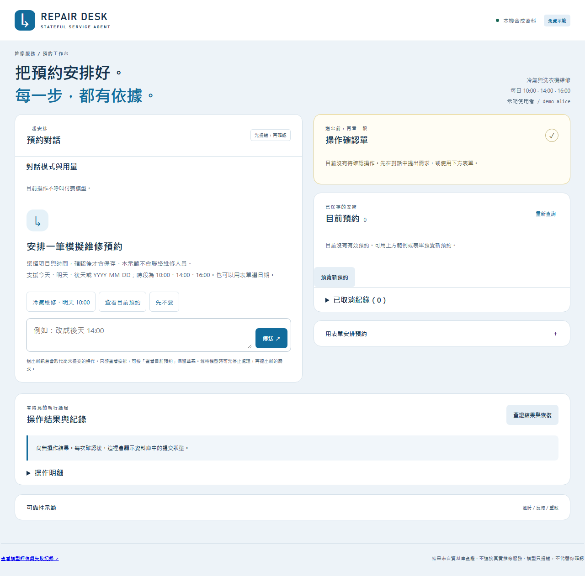

# Stateful Service Agent

### 用對話安排維修，確認後才真正建立預約。

你說「明天早上十點修冷氣」，系統整理成確認單；你確認後才保存預約。之後可以查詢、改期或取消，也能處理反悔、網路逾時與服務重啟。

這是一個可在本機操作的模擬作品。重點是讓 AI 提出的安排，確實、安全地變成資料庫中的預約。

**Python · FastAPI · SQLite · GPT-5.6 Luna · Playwright**

## 先看它怎麼運作

1. **提出需求**：輸入維修項目與時間，系統顯示確認單。
2. **核對並確認**：按下確認後，預約才會保存。
3. **查看結果**：畫面顯示目前預約與操作紀錄；遇到逾時，可查證是否已經完成。

下圖是工作台的操作畫面，**這張圖片不能直接操作**。想親手試用，請看下方「本機體驗」。



**想看實際操作？** [下載 19 秒操作影片](https://raw.githubusercontent.com/kuotunyu/stateful-service-agent/main/docs/demo/repair-desk-demo.webm)（WebM、無聲）。下載後開啟，可看到預約、反悔與故障恢復流程。

## 遇到意外，預約會怎樣？

| 情境 | 系統的處理方式 |
|---|---|
| 確認前說「先不要」 | 放棄草案，沒有新增預約；舊的確認單不能再使用。 |
| 已按確認，卻沒收到成功回覆 | 先查原操作是否已保存；若已完成，就顯示既有結果，不再建立一次。 |
| 已確認的操作尚未完成，服務就重啟 | 從保存的紀錄恢復仍有效的操作，避免遺漏或重複執行。 |

實作上，LLM 只負責提議；授權與版本由程式檢查，預約與提交收據一起寫入 SQLite，讓恢復流程有依據。

## 用結果驗證設計

**131 項自動測試通過 Windows CI**，涵蓋重複請求、競爭改期、真實子程序重啟、回覆遺失及完整鍵盤操作。操作錄影附六個 SQLite 檢查點，逐步核對確認前後的資料變更。

另以 **GPT-5.6 Luna** 比較「固定流程＋LLM 意圖解析」與「單一 Agent」：共用工具、政策與模型設定，以資料庫狀態及明確契約判分，不使用 LLM judge。

| 評估 | 固定流程 | 單一 Agent |
|---|---|---|
| 第一輪：8 題 | 資料庫結果正確 8/8；任務成功 7/8 | 資料庫結果正確 8/8；任務成功 8/8 |
| 第二輪：6 題 | 資料庫結果正確、任務成功皆 6/6 | 資料庫結果正確、任務成功皆 6/6 |

第一輪的任務失敗來自拒絕答案未遵守 JSON 格式。兩輪對應不同程式版本，題型部分重疊且樣本小，保留為實測證據，不據此宣稱策略優劣。Mock 測試與真實模型評估分開呈現。

[查看評估證據](docs/evaluations/README.md) · [自動測試結果](https://github.com/kuotunyu/stateful-service-agent/actions/workflows/tests.yml)

## 本機體驗

Windows 安裝 `uv` 後，在專案目錄執行：

```powershell
.\start.cmd
```

開啟 `http://127.0.0.1:8765`，輸入「預約冷氣維修，明天 10:00」。先預覽再確認，也可展開「可靠性示範」體驗逾時與查證。預設使用免費示範模式（Mock，固定句型），不需要 API key。

[操作、模型設定與測試命令](docs/guide.md)

本專案使用合成資料、單一 server process 與本機 SQLite；定位為可重現的工程展示，未提供正式登入或外部維修服務。實際 NVDA 朗讀驗收仍未完成。
