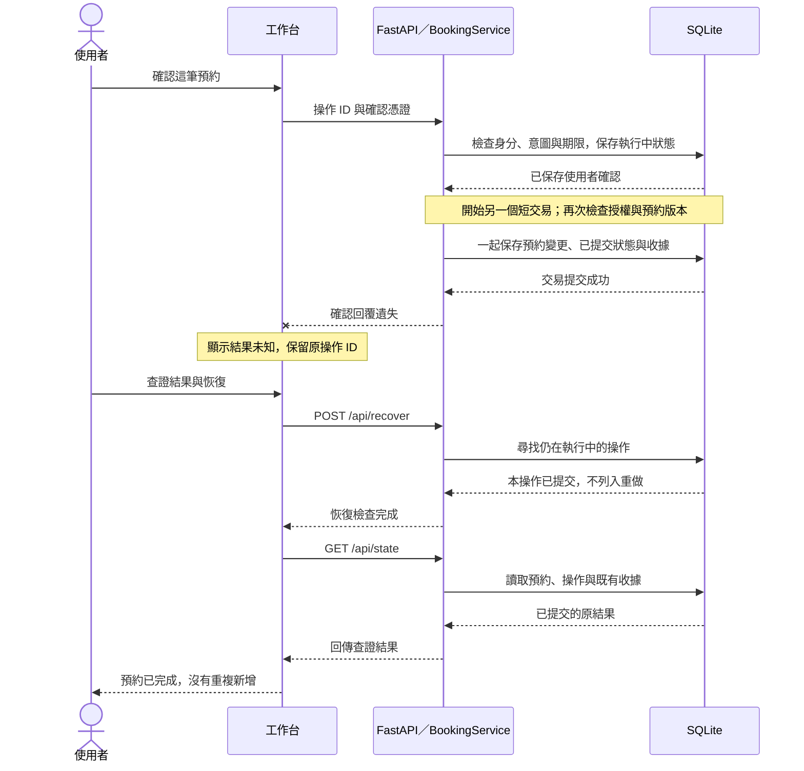
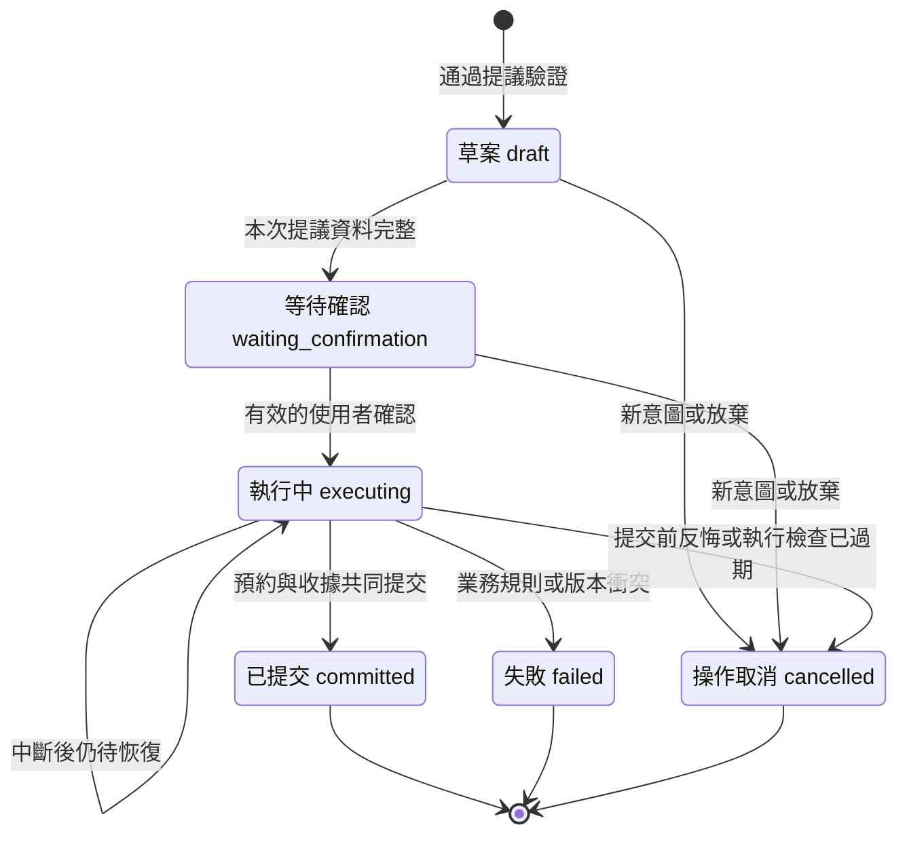

# 預約如何安全地完成與恢復

以下圖解對照現有程式，範圍限於單一 FastAPI 程序與本機 SQLite。首頁架構圖呈現責任分工；這裡補上時間順序與操作生命週期。

## 回覆遺失，不代表預約失敗

這張圖從使用者已有確認單開始，示範「資料已提交，但確認回覆遺失」。圖中的後端與資料庫是本機元件，沒有額外的工作流程服務。

**讀圖重點：**真正保存成功的時間早於介面知道成功的時間。恢復不是重送一筆新預約；已提交操作不會被恢復迴圈重新執行。重複確認原操作，也會回傳已保存的結果。

若中斷發生在預約交易提交之前，重啟會檢查仍為 `executing` 的操作：授權仍有效才繼續；意圖已變或期限已過就取消，版本或時段衝突則失敗。未經使用者確認的草案不會自動提交。

介面的 `after_commit` 故障示範會回傳「未知結果」，隨後可能立即查證成功；真正 HTTP 回覆遺失的介面處理由獨立瀏覽器測試覆蓋。本圖描述後者的查證順序，不表示每種故障都會顯示相同畫面。

## 一筆操作會經過哪些狀態？

圖中每個節點代表 `operations.status` 的資料庫狀態；「取消操作」與「取消一筆已存在的預約」是不同事情。

- **補資料會形成新意圖。** 草案資料不足時，後續訊息取消舊操作，再建立新草案；圖中的 `draft → waiting_confirmation` 是同一次提議資料完整時的轉換，不是讓舊確認單復活。
- **確認過期不等於立即改狀態。** 尚未確認的操作到期時，介面禁止確認，後端拒絕提交；資料庫可能仍為 `waiting_confirmation`。已確認的操作在執行／恢復時發現過期，才轉為 `cancelled`。
- **結果未知不是第七種狀態。** 介面沒有收到回覆時，資料庫可能是 `executing`，也可能已經 `committed`；必須查證。
- **已提交不沿原操作倒退。** 若要取消已保存的預約，需建立並確認一筆新的取消提議。新操作成功後是 `committed`，而預約本身的狀態才變成 `cancelled`。
- **失敗有範圍。** 圖中的 `failed` 指程式捕捉到的業務／資料限制錯誤；程序突然停止等非預期中斷可能留下 `executing`，交由恢復處理。

## 對照程式與驗證

| 圖中的機制 | 實作位置 |
|---|---|
| 提議、確認、執行、放棄與恢復 | [agent/service.py](../agent/service.py)：`propose`、`confirm`、`_execute`、`abandon`、`recover` |
| 狀態限制與交易提交／回滾 | [agent/db.py](../agent/db.py)：`SCHEMA`、`Database.connect` |
| 啟動恢復、可信身分與 API 入口 | [agent/app.py](../agent/app.py) |
| 未知結果、查證與確認過期提示 | [agent/static/app.js](../agent/static/app.js)：`confirmOperation`、`recover`、`confirmationExpired` |
| HTTP 回覆遺失的介面回歸 | [tests/test_ux_uncertain_browser.py](../tests/test_ux_uncertain_browser.py) |

圖解用來解釋設計，不新增測試或模型能力證據；實測結果與剩餘限制見 [目前進度](status.md)。
